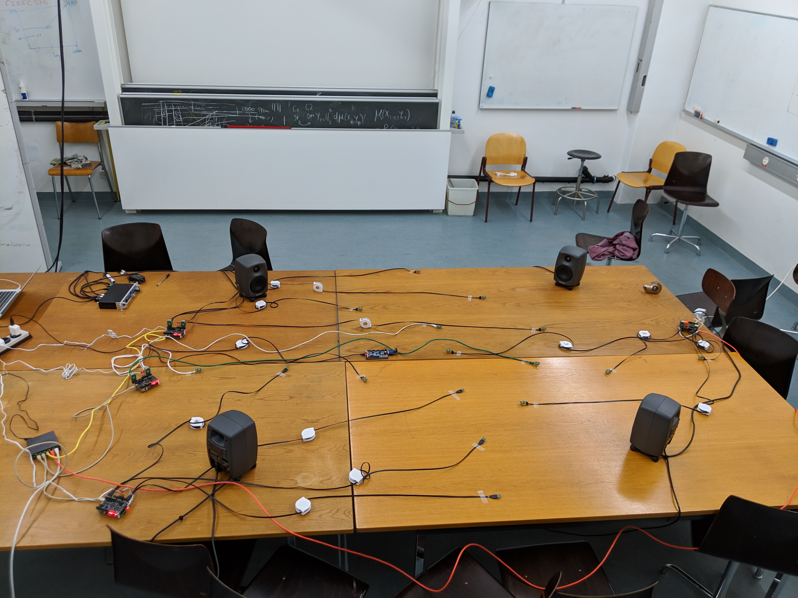

# WHISPER_SET_1

This repo contains metatadata and scirpts for using the `WHISPER SET #1` a dataset for speech enhancement and source separation recorded with a Wireless Acoustic Sensor Network (WASN) called WHISPER [Kiselev2018](https://ieeexplore.ieee.org/abstract/document/8110202). The dataset contains samples for up to 4 concurrent speakers and speech in noise. The dataset was recorded in a room with low reverberation (T_60 = 0.2 s) and using 16 microphones.

===

The raw data can be found [here](link). Each sample is a 16-channel wav file in
which the order of the channel follows the following logic:

0 - module 5 mic 1
1 - module 5 mic 2
2 - module 5 mic 3
3 - module 5 mic 4
4 - module 6 mic 1
5 - module 6 mic 2
6 - module 6 mic 3
7 - module 6 mic 4
8 - module 7 mic 1
9 - module 7 mic 2
10 - module 7 mic 3
11 - module 7 mic 4
12 - module 8 mic 1
13 - module 8 mic 2
14 - module 8 mic 3
15 - module 8 mic 4

Refer to the [floor plan](WHISPER4_floor_annotated.png) for a visual
illustration of the microphones arrangements.

===

# Info

## Floor plan

## Annotated floor plan

The microphones are numbered in such a way that the first digits represents the
module and the second the index in the module.

## Recordings text

[Recordings output](info.csv)

## Microphones position

Overall the microphones cover and area which is roughly a oval with major axis 2.3m and minor axis 1.5m.
With that said

    - The minimum distance between 2 mics was 0.1m (54 64)
    - The maximum distance between 2 mics was 2.3m (73 82)
    - The average is roughly 0.5m

## Speakers position
The speakers are 4. 2 are put is close distance to simulate a conversation.

    - The minimum distance between 2 speakers is 0.75m
    - The maximum distance between 2 speakers is 1.90m
    - The average distance between any 2 speakers is 1.5m

## Speakers to mics
For each speaker we report the closest and the furthest microphone

    1 - min 0.55m max 1.80m
    2 - min 0.50m max 1.90m
    3 - min 0.30m max 2.40m
    4 - min 0.70m max 2.30m
